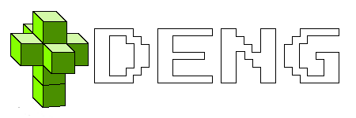

# DENG

  
DENG is a cross platform high level game development framework / engine designed to keep game development process
simple and straight forward. Currently not much has been implemented yet, but the list of already implemented 
features is following: 
* 3D model renderering  
* 2D model renderering  
* 2D shape generator  
* Editor and first person camera systems  
* Game entity data registry system  
* Asset texture mapping  
* Custom asset format  
* Wavefront OBJ parser
* Vulkan and OpenGL renderer system
* Point light (kinda broken)

Features that are not yet implemented but are coming soon are following:  
* Other lighting components (directional light and global light sources)  
* Lua scripting layer for game scripting  
* libjpeg and libpng integration for supporting additional texture formats  
* Custom mapdata format  
* Map editor tool  


## Building

Setting up build configuration is done using premake5. Premake5 generates configurations for both Windows 
and Linux based systems. There are two configurations available: release and debug configurations. Generally 
using debug mode is not recommended, since it significantly bloats up the binaries with additional debugging
symbols and backend API call error checks.


### GNU/Linux (tested on Debian 11)

On Debian based distributions you can install following packages that are required for building DENG  
```
$ sudo apt install libx11-6 libx11-dev libxcursor1 libxcursor-dev vulkan-validationlayers libglvnd0 libglvnd-dev
```

Also you should install premake5 and NOT premake4 as the build configuration does not support legacy premake 
versions. Link to repository can be found [here](https://github.com/premake/premake-core)

Clone the repository and all of its submodules with following command:  
`$ git clone --recursive https://github.com/inugami-dev64/deng`

Generate Makefiles using premake5:  
`$ premake5 --tests=<MODE> --no-deps gmake`

Build DENG using Makefiles:  
`$ make config=release_linux`


### Windows (tested on Windows 10 using Visual Studio 19)

#### Prerequisites

Make sure that you have installed all following programs and libraries that are required for windows builds:  
* Vulkan SDK - you can find the latest release [here](https://vulkan.lunarg.com/sdk/home#windows) and make sure 
that you use the default installation path, otherwise premake won't be able to find Vulkan headers and libraries 
required for linkage
* Visual Studio with C++ sdk - any version that isn't too ancient should work just fine
* Premake5 - it is recommend to build premake5 from source (link to git repository can be found [here](https://github.com/premake/premake-core)), 
although there are binary releases also available


#### Building steps

**Make sure that premake5 executable is added to the path!**

Clone the repository using following command:  
`> git clone --recursive https://github.com/inugami-dev64/deng`

Generate Visual Studio solution files using premake 
`> premake5 --tests=all --no-deps vs2019`
**PS! Given example assumes that Visual Studio 2019 is installed, if not specify appropriate version that is installed**  

Open generated deng.sln file with Visual Studio, select configuration as Release and build the solution.

## Usage
Refer to [USAGE.md](USAGE.md) for more information.
